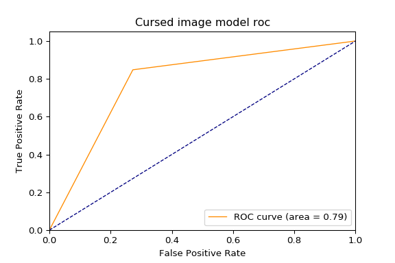
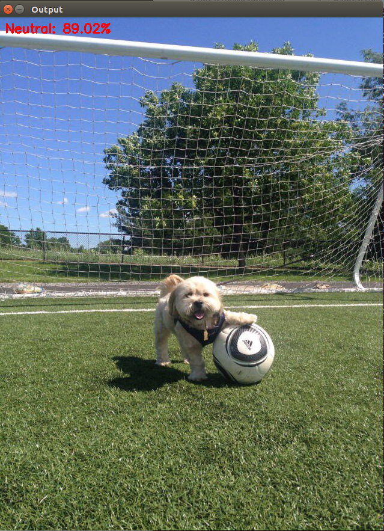
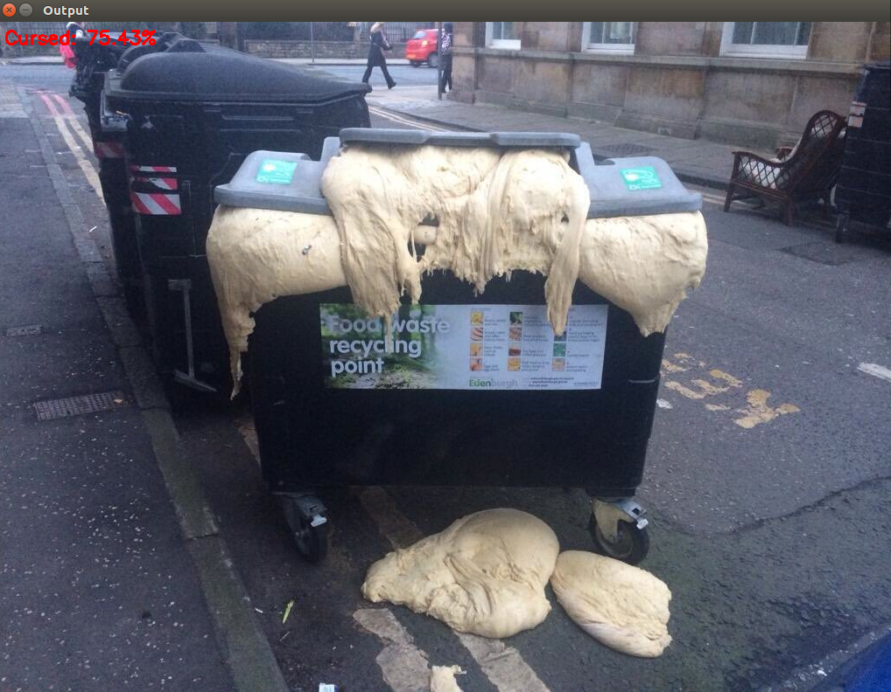

# Introduction

This is a very simple convnet classifier trained over a set of so-called "cursed" images scraped from [various](https://twitter.com/cursedimages) [sources](https://www.reddit.com/r/cursedimages/) and an equivalent number of "uncursed" images taken from the ["MIT 1003"](http://people.csail.mit.edu/tjudd/WherePeopleLook/index.html) image dataset. 

**EDIT**: I've tweaked the model a bit since the original round of commits and the performance is better (~80% accuracy now):

 

I think the training/testing code should still work with the new model architecture, making it a straight-up drop-in replacement. 

## What the hell are cursed images?!

If you don't know what a cursed image is, I highly recommend this video as an introduction (the section towards the end where they play "blessed or cursed" is what inspired this, neural networks are basically just foam alien puppet anthropologists anyway) :

[](https://youtu.be/SsNBhWxUIb0) 

Otherwise [KnowYourMeme's](https://knowyourmeme.com/memes/cursed-image) got arguably the best concise summary:

>Cursed Images are images that are captioned with the phrase "Cursed Image." They are generally pictures or photographs that are seen as disturbing to the viewer, either due to the poor photo quality or content within the image that is abnormal or illogical. Images of this or similar nature are sometimes seen as the visual equivalent to CreepyPasta. They have inspired several popular social media accounts devoted to posting various cursed images.

# Why do cursed images matter?

The network in this repo can help _find_ cursed images, but it doesn't say much about what _makes_ a cursed image cursed. Having created a tool to help identify them, the next step is to break down the properties that this classification system is using to do this. One thing I think we'll ultimately see is that in a couple of simultaneous domains, cursed images are really just a mostly natural, emergently organized _image anomaly dataset_. This could potentially make them useful in a number of computer-vision and other scientific/practical contexts. 

I'll put up some of the work I've been doing along these lines when it's a little more complete/I actually have some results.

# How do I use this?

1. Clone or download the repository.
2. Download my pre-trained model architecture and weights from [this link](http://tinyurl.com/yakeglyf). Extract the h5 and the json files from the package and move them to the "out" directory in this repository.
3. Setup an appropriate Python environment using the provided requirements.txt file (I recommend Anaconda).
3. If you want to train your own version of the network, I've provided code to do so both for setting up the tools to scrape the images and to train the model. Run the first three commands in the Makefile to setup the right folder structure in the repository, download [RipMe](https://github.com/RipMeApp/ripme), and scrape from the cursed images Twitter and subreddit. Run the "train_model" make command to train the network (you can alter argparse parameters for the model training process in the training function file).
4. Add your own "neutral" images from whatever free source you've got to hand. The dataset I used is nice in that it contains a pretty broad range of lighting conditions, scene contexts, human/face content, photographic vantage points, etc, and that will definitely help your model make more accurate judgments.
5. With either the pretrained or your own model in the right directory, run:

```
python funs/demo_cursed_image_model.py --image_path=path_to_some_image
```

to get back an estimate of whether your image is cursed, and just how cursed it is!

# Examples

Definitely Not Cursed             |  Definitely Cursed
:-------------------------:|:-------------------------:
  |  

# A note of caution

Some of the stuff that seems to make some cursed images cursed is inarguably humanly ugly/upsetting/copyrighted. I don't intend by this project to tacitly or explicitly condone having images of that stuff floating around on the internet, and I certainly don't support any use or dissemination of them for the purposes of hurting, degrading, or marginalizing anybody. If you use it to those ends/claim that's what I was after, you're doing so without my knowledge or approval. 

The sites this project is setup to scrape from are _pretty_ good about filtering out obvious gore/violence content, but it is out there and if you go looking you're going to find it. 

It's for these reasons I'm not providing my dataset directly. 

I think the project is worth pursuing in spite of this because most of what counts as cursed is actually goofy and hilarious in a harmlessly absurd way, and because maybe we can use these things to accomplish some interesting stuff scientifically.